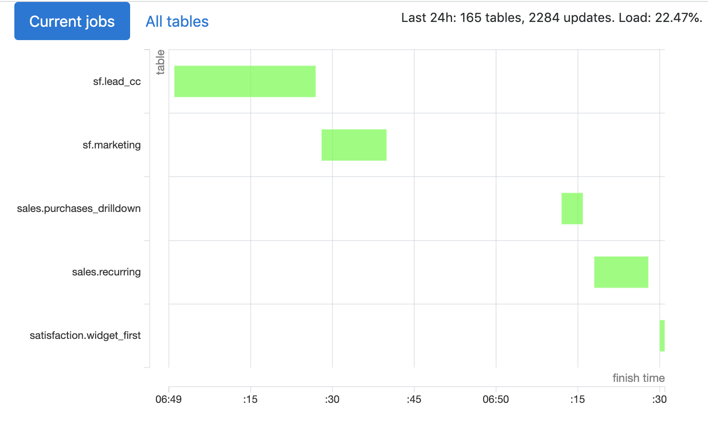

# Duro
Duro creates materialized views in Redshift using specified intervals and tracking their interdependencies.

_[“Duro” is a spell Hermione uses to turn two Death Eaters to stone](https://en.wikibooks.org/wiki/Muggles%27_Guide_to_Harry_Potter/Magic/Duro)_.

Other features:
- web UI; 
- tests;
- Python post-processing.



## An example
We have a wide table with lots of data about cities in `first.cities_raw`, and we would like to have a smaller and more usable city-country mapping in `first.cities`:
```redshift
select city, country
from first.cities_raw
```

```
first:
  - cities — 24h.sql
``` 

Alternatively, you can put this file on a higher level in directory hierarchy:

```
views:
  - first.cities — 24h.sql
```

Now we’ll be recreating this view every 24 hours.

Let’s add a simple test and save to `cities_test.sql`:

```redshift
select (city = 'Paris') as correct_capital_of_france
from first.cities
where country = 'France';
select (city = 'Ottawa')  as correct_capital_of_canada
from first.cities
where country = 'Canada';
```

If any of these values is not `true`, we don’t replace older version of `first.cities` with the new one.

Now let’s also add a config for this table in the same folder:

```
first:
  - cities — 24h.sql
  - cities_test.sql
  - cities.conf
``` 

```
grant_select=jane, john
diststyle=even
distkey=city
sortkey=city
```

This will specify distkey, sortkey, and diststyle for our table, and run `grant select on first.cities to jane, john;`.

You can see these examples in `tests/views` folder.

Obviously, for this to work, someone has to set up everything correctly (and, honestly, this setting up part could’ve been better).


## How does it work
Duro has three main parts: scheduler, creator, and web interface server.

Scheduler goes through your directory, finds tables’ definitions and configurations, detects dependencies, and saves all this information to a local SQLite database. You probably want to set scheduler to run every time there is an update in your Git repository with views’ definitions. 

Web interface shows currently and recently run jobs, statistics and logs for each table, and allows you to force updates. You can probably run it using gunicorn and reverse proxy server or whatever setup you prefer—it’s a pretty simple Flask app.

Creator queries this database for tables that should be updated (either because they haven’t been recreated for longer than their interval requires or because their update has been forced via web UI), and updates both their dependencies (first and if necessary) and these tables. You probably want to have this process continuously running (e.g., via [supervisor](http://supervisord.org/)). 


What do we do after deciding that this particular table should be updated?
For views without Python processing:
1. Read query and config for this table from the database.
2. Create `schema.table_duro_temp` using `create table as` query.
3. Run tests on `schema.table_duro_temp` (if there are any). Drop temporary table if tests fail, send notification about this failure.
4. If any (non-materialized) views depend on `schema.table`, update their definitions to use `schema.table_duro_temp`.
5. Rename `schema.table` to `schema.table_duro_old`.
6. Rename `schema.table_duro_temp` to `schema.table`.
7. Drop `schema.table_duro_old`.
8. If necessary, create a snapshot of `schema.table`.

For tables with Python processing:
1. Read query and config for this table from the database.
2. Create virtual environment at `venvs/schema.table`.
3. Install requirements from `schema/table_requirements.txt`.
4. Select data using query in `schema/table_select.sql`; export this data to CSV.
5. Run `schema/table.py` in that virtual environment; this script should read CSV from file in its `argv[1]` and write to CSV in `argv[2]`.
6. Upload resultant CSV to S3.
7. Create `schema.table_duro_temp` using DDL in `schema/table — {interval}.sql`.
8. `copy` data from CSV in S3 to `schema.table_duro_temp`.
9. Run steps 3–8 from sequence for views without Python processors.


## Deployment


## Global config and credentials
We read credentials for Redshift, S3, and Slack from `duro/config.conf`. You can find a template for this file in `duro/config.conf_example`.

We recommend creating a dedicated Redshift user. You will probably find it simpler to just give this user superuser permissions.  


## Table and schema configs


## Python processing


## Scheduler checks (DAGs, configs)


## FAQ
### Hasn’t Amazon already added materialized views?
Yes, materialized views were (re)introduced in November 2019, but at the moment (January 2020) they’re still in preview stage and have quite a lot of [limitations](https://docs.aws.amazon.com/redshift/latest/dg/mv-usage-notes.html), most important of which is their inability to depend on other materialized views.

### Wouldn’t it be great to have duro running in a Docker container?
It would.

### 

 
