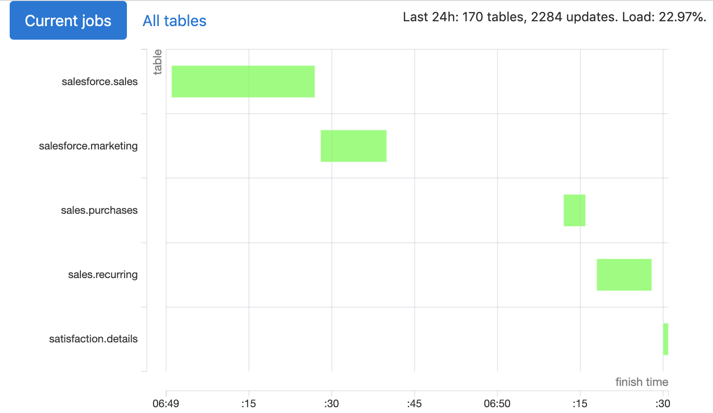
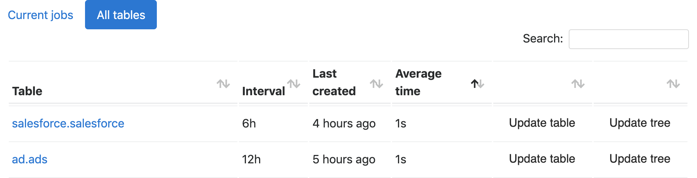

# Duro
Duro creates [materialized views](https://en.wikipedia.org/wiki/Materialized_view) in Amazon Redshift using specified intervals and tracking their interdependencies. Just put `select` queries into a repository and have them as standard tables with fresh data.

_[“Duro” is a spell Hermione uses to turn two Death Eaters to stone](https://en.wikibooks.org/wiki/Muggles%27_Guide_to_Harry_Potter/Magic/Duro)_.

Other features:
- web UI; 
- tests;
- Python post-processing.



## An example
We have a wide table with lots of data about cities in `first.cities_raw`, and we would like to have a smaller and more usable city-country mapping in `first.cities`:
```redshift
select city, country
from first.cities_raw
```

Now save this file and add desired update interval to its name:
```
first:
  - cities — 24h.sql
``` 

Alternatively, you can put this file on a higher level in directory hierarchy (and use hyphens instead of dashes):
```
views:
  - first.cities - 24h.sql
```

Now we’ll be recreating `first.cities` every 24 hours.

Let’s add a simple test and save it to `cities_test.sql`:

```redshift
select (city = 'Paris') as correct_capital_of_france
from first.cities
where country = 'France';
select (city = 'Ottawa')  as correct_capital_of_canada
from first.cities
where country = 'Canada';
```

If any of these values is not `true`, we don’t replace older version of `first.cities` with the new one.

Now let’s also add a config for this table in the same folder:

```
first:
  - cities — 24h.sql
  - cities_test.sql
  - cities.conf
``` 

`cities.conf`:
```
grant_select=jane, john
diststyle=even
distkey=city
sortkey=city
```

This will specify distkey, sortkey, and diststyle for our table, and run `grant select on first.cities to jane, john`.

You can see these examples in `tests/views` folder.

Obviously, for this to work, someone has to set up everything correctly (and, honestly, this [setting up part could’ve been better](#deployment)).

## How does it work
Duro has three main parts: scheduler, creator, and web interface server.

Scheduler goes through your directory, finds tables’ definitions and configurations, detects dependencies, and saves all this information to a local SQLite database. You probably want to set scheduler to run every time there is an update in your Git repository with views’ definitions. 

Web interface shows currently and recently run jobs, statistics and logs for each table, and allows you to force updates. You can probably run it using gunicorn and reverse proxy server or whatever setup you prefer—it’s a pretty simple Flask app.

Creator queries this database every 30 seconds for tables that should be updated and updates both their dependencies (if necessary) and these tables. You probably want to have this process continuously running (e.g., via [supervisor](http://supervisord.org/)). 

When creator see a table in need of update, it first goes through its tree of dependencies. 

Let’s say we have these three tables:

```
first:
  - cities — 24h.sql
  - shops.sql 
  - people — 1h.sql
```

`people` depends on `shops`, and `shops` depends on `cities`. When it’s more than one hour since `people` has last been updated, creator loads the tree for `people` and recursively goes through it:
1. `people` has one child (`shops`), let’s create its tree first.
2. `shops` has one child (`cities`), let’s create its tree first.
3. `cities` has no dependencies, let’s see we should update this table itself.
4. If it’s older than 24 hours, yes, if not, no.
5. Let’s go up to `shops` now. It doesn’t have any interval specified, so we interval of its parent. If it’s older than 1 hour, we recreate `shops`.
6. Now we can recreate `people`.

Usually we have intervals specified for roots (these are mostly the tables used in reports or and for actually useful queries) and for longer-running dependencies (there’s no to recalculate [MAU](https://en.wikipedia.org/wiki/Active_users) every hour).

What do we do after deciding that this particular table should be updated?
For views without Python processing:
1. Read query and config for this table from the database.
2. Create `schema.table_duro_temp` using `create table as` query.
3. Run tests on `schema.table_duro_temp` (if there are any). Drop temporary table if tests fail, send notification about this failure.
4. If any (non-materialized) views depend on `schema.table`, update their definitions to use `schema.table_duro_temp`.
5. Rename `schema.table` to `schema.table_duro_old`.
6. Rename `schema.table_duro_temp` to `schema.table`.
7. Drop `schema.table_duro_old`.
8. If necessary, create a snapshot of `schema.table`.

For tables with Python processing:
1. Read query and config for this table from the database.
2. Create virtual environment at `venvs/schema.table`.
3. Install requirements from `schema/table_requirements.txt`.
4. Select data using query in `schema/table_select.sql`; export this data to CSV.
5. Run `schema/table.py` in that virtual environment; this script should read CSV from file in its `argv[1]` and write to CSV in `argv[2]`.
6. Upload resultant CSV to S3.
7. Create `schema.table_duro_temp` using DDL in `schema/table — {interval}.sql`.
8. `copy` data from CSV in S3 to `schema.table_duro_temp`.
9. Run steps 3–8 from sequence for views without Python processors.


## Deployment
Here’s our setup for duro:
1. EC2 machine in the same data center and subnet as our Redshift.
2. Manually cloned duro repository.
3. Manually created virtual environment, manual updates (`git pull; pip install -r requirement.txt`).
4. Manually cloned repository with views’ definitions.
5. Manually edited `config.conf` (credentials for Redshift, S3, and Slack, path to views).
6. supervisor constantly running `create.py`.
7. supervisor constanly running `server.py`.
8. bash script that pulls our git repository with views and runs `schedule.py`; run by cron every minute.

We previously used TeamCity for views redeployments, and since this job is super-simple, you can probably use almost any CI/CD tool.

Here’s the script we use to pull updates:

```bash
AGENT="ssh-agent -s"
if [ ! -d $HOME/.ssh/agent ]; then
        mkdir -p $HOME/.ssh/agent
fi
pid=`ps -u$LOGNAME | grep ssh-age | awk '{print $1}'`
if [ -z "$pid" ]; then
        $AGENT | grep -v echo > $HOME/.ssh/agent/ssh_agent & pid=$!
        sleep 1 
fi
. $HOME/.ssh/agent/ssh_agent
ssh-add ~/.ssh/github

cd /home/ubuntu/views
git pull && cd /home/ubuntu/duro/duro && ../venv/bin/python schedule.py 
```

Most of it just checks that we don’t start a copy of ssh_agent every minute, actual job is being done in the last two lines.

Scheduler tracks commits, so most of the time it doesn’t do any rescheduling. 

## Config and credentials
We read credentials for Redshift, S3, and Slack from `duro/config.conf`. You can find a template for this file in `duro/config.conf_example`.

We recommend creating a dedicated Redshift user. You will probably find it simpler to just give this user superuser permissions.  

Slack section has three channels: `failure_channel`, `success_channel`, and `log_channel`. First one will receive error notifications, second one will receive notifications about successful updates (e.g., ”New tables: first.countries. Updated tables: first.cities.”), third one is used only by `slack_log.py` (if you would like to receive regular updates with stats and confirmations that duro is indeed doing something).


## Table and schema configs
You can specify distkey, sortkey, and diststyle for the table, as well as grant `select` permissions via table configs. Moreover, you can do this using inherited values from schema and global configs.

Let’s say you want to have all your materialized views available in [Metabase](https://www.metabase.com/) (which connects to Redshift using `metabase` user). Add `global.conf` to the root of your views folder:

```
grant_select=metabase
```

However, you don’t want this user to see tables in `finances` schema. Let’s add this `finances.conf`:

```
grant_select-=metabase
```

But maybe `finances.simplified` should be visible in Metabase. `finances/simplified.conf`:

```
grant_select+=metabase
``` 

Distkey, sortkey, and diststyles are also inherited, however, we don’t support `+=` and `-=` syntax there. You can either override (`sortkey=another_field`) or reset (`sortkey=null`).

## Python processing
Instead of simple `create table as (select)` you can have Python scripts doing some processing. For them to work, you need three or four files:

```
first:
  - countries_select.sql
  - countries.py
  - countries — 1h.sql
  - countries_requirements.txt
```

`countries_select.sql` selects data which is then exported to CSV. `countries.py` receives as arguments both path to this CSV and path to which it should write resultant CSV. Here’s a barebone version:

```python
import csv
import sys

def process(data):
    return data

if __name__ == "__main__":
    with open(sys.argv[1]) as csvin:
        data = list(csv.reader(csvin))

    processed = process(data)

    with open(sys.argv[2], "w") as csvout:
        writer = csv.writer(csvout)
        writer.writerows(processed)
```

After we have this CSV, we need to know how to create a table for this data. We could guess from actual data, but this isn’t reliable and would lead to inconsistencies. So you need to provide `create table` query as well:

```redshift
create table first.countries(
city text encode zstd,
country text encode zstd
)
```

This definition goes to the file with the interval in its name (`countries — 1h.sql`). The idea is that you should be able to understand at least what are the fields in some view by just looking at its `name — interval` file.

If you use some external libraries, add them to `_requirements.txt` file: we create separate virtual environment for each processor.

## Snapshots 
If you need history of previous versions for some table, you can enable snapshots for this table. Add these lines to `table_name.conf`:
```
snapshots_interval=24h
snapshots_stored_for=90d
```

After successful recreations duro will put new version into `table_name_history` (if previous snapshot is older than 24 hours). If there are some snapshots older than 90 days, those will be deleted. Obviously, both `interval` and `stored_for` can have other values. 

Note: snapshots currently don’t support schema changes for the table, so after updates you have to drop or alter `_history` table manually. Sorry.

## Scheduler checks (DAGs, configs)
Before putting updates into database, scheduler builds a graph of dependencies (which is also saved and used later by creator). It can optionally check if this graph is acyclic (for now it’s hardcoded as `strict=False` in `duro/schedule.py`—mostly because we couldn’t disentangle our interdependencies). It tries to deal with cycles in other ways and won’t just hang if there is one, so in the worst case you should receive a notification about failed query.

We also check for:
- missing files for views with Python processors;
- missing intervals. If your dependency graph is `A→B→C` (that is, A’s definition mentions B and B’s definition mentions C), it’s okay for B and C not to have specified intervals, but if A doesn’t have any interval, duro won’t know when to update it;
- wrong distkeys and sortkeys in configs. If you specify a field that’s absent from table’s definition (and this definition doesn’t have `select *`), table’s creation will fail. We also check this for inherited configs.

## Web UI
Main page (see screenshot above) shows currently and recently created tables (charts are powered by [taucharts](https://taucharts.com)). You can try zeroing in on specific intervals using URLs like `{duro}/2020-01-19T20:30:00/2020-01-19T20:40:00/`.

“All tables” is a table of tables sorted by their last update. You can use this page to force updates.



Table page has a graph for table creation time and a log of recent updates.

## FAQ
### Hasn’t Amazon already added materialized views?
Yes, materialized views were (re)introduced in November 2019, but at the moment (January 2020) they’re still in preview stage and have quite a lot of [limitations](https://docs.aws.amazon.com/redshift/latest/dg/mv-usage-notes.html), most important of which is their inability to depend on other materialized views.

### How long are you running this in production?
We’ve been using duro for more than two years now and currently have 170 views with ~2200 recreations every day.

### What about [dbt](https://www.getdbt.com/)?
When we just started developing duro, dbt was much less mature, so we couldn’t use it anyway. Although there are quite a lot of similarities, duro has a greater focus on scheduling. We also think that dependencies should be detected by machines.

### Speaking of dependencies, do you do some kind of smart code analysis?
Nah, we just search for views’ names in other views’ definitions.

### Wouldn’t it be great to have duro running in a Docker container?
It would.
